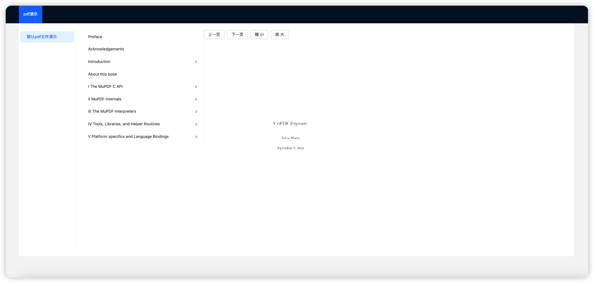

# leafer-pdf-plugin

pdf loves leaferjs

## show



## run demo project

```shell
npm i
npm run dev
```

## usage

```js
import { PDF } from "leafer-pdf-plugin";
import { Leafer, usePlugin } from "leafer-ui";
usePlugin(PDF);
const pdf = await PDF.load("/test.pdf", {
  zoomLevels: [
    50, 55, 60, 65, 70, 75, 80, 85, 90, 95, 100, 110, 120, 130, 140, 150, 160,
    170, 180, 190, 200,
  ],
  dpi: 96,
});
console.log(pdf.outline);
```

- dpi; //文档 dpi
- pages; // PDF 总页数
- \_current; // 当前为第几页
- pageWidth; //当前页面的宽度
- pageHeight; //当前页面的高度
- loading; //PDF 后端是否处于加载状态
- documentTitle; //PDF 文档的名字
- \_zoom; //PDF 文档当前缩放率
- zoomLevels; //PDF 文档缩放级别
- \_outline; //PDF 文档的大纲
- backend; //PDF 后端的能力
- \_imgData; //图片的数据
- \_image; //当前缓存的图片
- \_group; //当前缓存的 group

- src/PdfLoader.js is the main class that export some functions to operate pdf

## update plan

- todo
